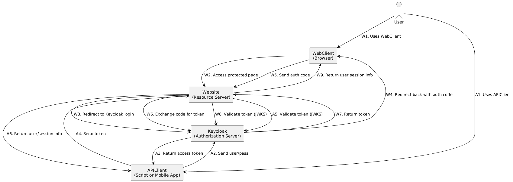

# Architecture Diagram

The IAM architecture integrates Keycloak as the Identity Provider (IdP) and a Flask-based microservice as the Resource Server.

Components:

* User: Initiates authentication via a web client or API client.
* Web Client: Navigates to Resource Server
* API Client: Interacts with Authorization Server and Resource Server directly
* Flask App (Resource Server): Handles protected resources and validates access tokens.
* Keycloak (Authorization Server): Manages user authentication and issues tokens.

# OAuth 2.0 and OIDC Flows

OAuth 2.0 Authorization Code Flow:

    Authentication Request: The user is redirected from the Flask app to Keycloak for authentication.

    Authorization Code Grant: Upon successful login, Keycloak issues an authorization code.

    Token Exchange: The Flask app exchanges the authorization code for an access token and an ID token.

    Resource Access: The access token is used to access protected resources on the Flask app.

OpenID Connect (OIDC) Extension:

    ID Token: Provides user identity information (e.g., email, roles) and is used for session management and personalization.
    User Guide and Engine Fix Collection

# Security Analysis: STRIDE Threat Modeling

## STRIDE

| **Threat**                 | **Description (IAM Context)**                                                       | **Example**                                                                                      |
| -------------------------- | ----------------------------------------------------------------------------------- | ------------------------------------------------------------------------------------------------ |
| **Spoofing**               | Attacker impersonates a legitimate user or service.                                 | Reusing stolen tokens or credentials to access protected APIs.                                   |
| **Tampering**              | Unauthorized modification of data (e.g., tokens, session state).                    | Modifying JWT to elevate privileges.                                                             |
| **Repudiation**            | Users deny performing actions, and no sufficient logging exists to prove otherwise. | Malicious API calls with no associated audit trail.                                              |
| **Information Disclosure** | Sensitive information is exposed to unauthorized users.                             | Exposing tokens, user data, or JWKS keys in logs or public endpoints.                            |
| **Denial of Service**      | Attacker overwhelms Keycloak or resource server, affecting availability.            | Flooding token endpoint or protected API.                                                        |
| **Elevation of Privilege** | Unauthorized users gain higher access levels.                                       | A user with `user` role accessing `admin` functions by modifying claims or misconfiguring roles. |

## Mitigation Strategies

| **Threat**                 | **Mitigation Strategy**                                                                                                                                |
| -------------------------- | ------------------------------------------------------------------------------------------------------------------------------------------------------ |
| **Spoofing**               | - Enforce **MFA** in Keycloak.   - Validate token `iss`, `aud`, and `exp` claims.   - Use HTTPS for all communications.                          |
| **Tampering**              | - Use **signed JWTs (RS256)** and validate with Keycloak’s **JWKS endpoint**.   - Never trust incoming claims without validation.                   |
| **Repudiation**            | - Enable **audit logging** in Keycloak and Flask.   - Include user `sub`, IP address, and `action` in logs.                                         |
| **Information Disclosure** | - Use **short-lived tokens** (e.g., 5–10 mins).   - Avoid logging tokens or secrets.   - Use `secure`, `HttpOnly` cookies if using web sessions. |
| **Denial of Service**      | - Implement **rate limiting** and timeouts at NGINX/Flask.   - Use **Docker resource limits** (CPU, memory).                                        |
| **Elevation of Privilege** | - Use strict **role-based access control (RBAC)** in Keycloak.   - Validate roles in the Flask app before granting access.                          |

# Okta Case Study

The 2023 Okta breach, where attackers accessed session tokens via HAR files uploaded for support, highlighted critical security lapses:
Fast Company

    Session Management Flaws: Exposed the need for secure handling of session tokens.

    Insufficient Access Controls: Emphasized the importance of strict access controls and monitoring.

Impact on Design:

    Enhanced Token Security: Implement short-lived tokens and avoid storing sensitive tokens in logs or support files.

    Zero Trust Architecture: Adopt a security model where no component is inherently trusted; continuously verify all access requests.

    Comprehensive Monitoring: Establish robust monitoring and alerting mechanisms to detect and respond to suspicious activities promptly.
    SivaLabs+4All About Testing+4