# Architecture Diagram

The IAM architecture integrates Keycloak as the Identity Provider (IdP) and a Flask-based microservice as the Resource Server.

Components:

* User: Initiates authentication via a web client or API client.
* Web Client: Navigates to Resource Server
* API Client: Interacts with Authorization Server and Resource Server directly
* Flask App (Resource Server): Handles protected resources and validates access tokens.
* Keycloak (Authorization Server): Manages user authentication and issues tokens.

# OAuth 2.0 and OIDC Flows

The system primarily uses the OpenID Connect (OIDC) Authorization Code Flow for user authentication and the OAuth 2.0 Bearer Token mechanism for API authorization.

a. OIDC Authorization Code Flow (User Login):

    Initiation:
        The user accesses the Flask app's homepage (/) and clicks "Login".
        The /login route in the Flask app initiates the OIDC flow.
        A unique nonce is generated and stored in the user's session to mitigate replay attacks.
        The Flask app, acting as an OIDC Relying Party (Client), redirects the user's browser to Keycloak's authorization endpoint (keycloak.authorize_redirect). The request includes client_id, scope ('openid email profile'), response_type=code, redirect_uri, and the nonce.

    User Authentication at Keycloak:
        The user is presented with Keycloak's login page.
        The user enters their credentials (e.g., test-user / password).

    Authorization Grant (Code):
        Upon successful authentication, Keycloak generates an authorization code and redirects the user back to the Flask app's redirect_uri (/auth). The authorization code is included as a query parameter.

    Token Exchange:
        The /auth route in the Flask app receives the authorization code.
        The Flask app makes a back-channel request to Keycloak's token endpoint (keycloak.authorize_access_token()), exchanging the authorization code, its client_id, and client_secret for an ID Token and an Access Token. (The flask-client is confidential, so it uses its secret).

    Token Validation & Session Creation:
        The Flask app validates the received ID Token:
            The signature is verified using Keycloak's public keys (implicitly handled by authlib using the server_metadata_url).
            The nonce is validated against the one stored in the session.
            Other claims like iss (issuer) and aud (audience) are also validated (implicitly by authlib).
        User information from the ID Token (userinfo) is stored in the session.
        The user is then redirected to the /profile page, which displays their information.

b. OAuth 2.0 Bearer Token (API Authorization):

    Client Request:
        A client (e.g., cURL, another application) makes a request to a protected API endpoint in the Flask app (e.g., /protected).
        The request must include an Access Token (obtained via an OAuth 2.0 grant, like the ROPC grant enabled for the client or the one obtained during OIDC login) in the Authorization header as a Bearer token (e.g., Authorization: Bearer <your_token>).

    Token Validation at Flask App (Resource Server):
        The Flask app extracts the token from the header.
        It fetches Keycloak's JSON Web Key Set (JWKS) URI (/protocol/openid-connect/certs) to get the public keys.
        The Access Token's signature is verified using these public keys.
        Claims such as iss, aud, and exp (expiration) are validated.

    Access Control:
        If the token is valid, the Flask app grants access to the protected resource and returns the requested data.
        If the token is missing, invalid, or expired, a 401 Unauthorized error is returned.

c. Resource Owner Password Credentials (ROPC) Grant:

    The Keycloak client flask-client has directAccessGrantsEnabled: true set in its configuration. This means the ROPC grant type is allowed.
    The test.py script demonstrates how to obtain an access token directly using this grant by sending a POST request to Keycloak's token endpoint with grant_type=password, client_id, client_secret, username, and password. This flow is typically used by trusted first-party applications but is generally discouraged for third-party clients or if a more secure flow like Authorization Code is feasible.

# Security Analysis: STRIDE Threat Modeling

The STRIDE model helps identify potential security threats:

S - Spoofing Identity

- Threat: An attacker impersonates a legitimate user, client pplication (Flask), or the Identity Provider (Keycloak).
    - User Spoofing: Gaining access to user credentials (e.g., test-user/password) through phishing, weak passwords, or credential stuffing.
    - Flask App Spoofing: A malicious application tries to impersonate the legitimate Flask client to Keycloak.
    - Keycloak Spoofing: An attacker sets up a fake Keycloak instance to harvest credentials (phishing).
- Mitigation:
    - User Spoofing:
            Strong Password Policies: Enforce complexity, length, and rotation in Keycloak.
            Multi-Factor Authentication (MFA): Configure MFA in Keycloak for users (e.g., TOTP). Currently not explicitly configured in realm-export.json but Keycloak supports it.
            Account Lockout: Configure account lockout policies in Keycloak after multiple failed login attempts.
            User Education: Train users to identify phishing attempts.
    - Flask App Spoofing:
            Client Secrets: The flask-client is confidential and uses a client_secret for token exchange. This secret must be securely stored by the Flask app (e.g., using environment variables managed securely, as done via docker-compose.yml).
            Registered Redirect URIs: Keycloak enforces strict matching of redirect_uri values, preventing token diversion to malicious sites.
    - Keycloak Spoofing:
            HTTPS Everywhere: Ensure all communication with Keycloak uses HTTPS with valid certificates (not just http://localhost as in dev). The server_metadata_url for Keycloak in app.py uses http://host.docker.internal:8080, which is for local Docker development. Production would require HTTPS.
            User Awareness: Educate users to verify the domain of the IdP.

T - Tampering with Data

- Threat: An attacker modifies data in transit or at rest.
    - Token Modification: Altering claims within a JWT (ID Token or Access Token).
    - Parameter Tampering: Modifying request parameters during OIDC/OAuth flows (e.g., redirect_uri, state, scope).
     - Session Hijacking: Modifying session data stored by the Flask app.
- Mitigation:
    - Token Modification:
            Digital Signatures (JWS): All JWTs (ID and Access Tokens) issued by Keycloak are digitally signed using an algorithm like RS256 (Keycloak's default). The Flask app validates this signature using Keycloak's public keys from the JWKS endpoint. This ensures token integrity.
    - Parameter Tampering:
            HTTPS: Protects data in transit, preventing modification of parameters.
            State Parameter (OIDC): While not explicitly shown in app.py's authorize_redirect call, Authlib typically handles state parameter generation and validation for OIDC Authorization Code Flow to prevent CSRF and ensure the response corresponds to the original request.
            Nonce Parameter (OIDC): Used to prevent ID Token replay attacks; validated by the Flask app.
            Strict Redirect URI Validation: Keycloak validates the redirect_uri.
    - Session Hijacking:
            Secure Session Cookies: Flask session cookies should be configured with HttpOnly, Secure (in production), and SameSite attributes. app.secret_key is used for signing session cookies.
            Short Session Expiry: Implement reasonable session timeouts.

R - Repudiation

- Threat: Users deny performing an action, or the system cannot trace actions to a specific user.
    - Denial of Transaction: A user denies initiating a login or accessing a protected resource.
- Mitigation:
    - Audit Logging in Keycloak: Keycloak provides extensive logging capabilities for events like logins, token issuance, admin actions, etc. These logs should be enabled, collected, and monitored. (See Keycloak Admin UI and documentation).
    - Audit Logging in Flask App: The Flask application should log significant events, such as access to protected resources, associating them with the authenticated user identity (e.g., sub claim from the JWT).
    - Secure Timestamps: Ensure all logs have accurate and synchronized timestamps.

I - Information Disclosure

- Threat: Sensitive information is exposed to unauthorized individuals.
    - Token Leakage: Access Tokens or ID Tokens are leaked (e.g., via browser history, logs, insecure storage, man-in-the-middle if not HTTPS).
    - Client Secret Leakage: The flask-client's secret is exposed.
    - Sensitive Data in JWTs: ID Tokens or Access Tokens contain overly sensitive user information not required by the resource server.
    - Error Message Verbosity: Detailed error messages reveal system internals.
- Mitigation:
    - Token Leakage:
        - HTTPS: Enforce TLS for all communications to protect tokens in transit.
        - Short Token Lifetimes: Configure short expiration times for Access Tokens in Keycloak. Refresh tokens can be used to obtain new Access Tokens without re-authenticating the user directly.
        - Bearer Token Security: Treat bearer tokens as sensitive credentials. Do not log them unnecessarily or store them insecurely on the client-side. The Okta case study highlights risks of HAR files containing tokens.
         -Token Revocation: Keycloak supports token revocation. Implement mechanisms for users or admins to revoke tokens if compromised.
    - Client Secret Leakage:
        - Secure Storage: The KEYCLOAK_CLIENT_SECRET is passed as an environment variable. Ensure the environment where the Flask app runs is secure, and access to these variables is restricted.
        - Consider PKCE: For public clients (not the case here as flask-client is confidential), Proof Key for Code Exchange (PKCE) should be used instead of client secrets.
        Sensitive Data in JWTs:
        - Scope Limitation: Use OIDC scopes (openid email profile) to request only necessary user information.
        - Token Claims Configuration: Configure Keycloak mappers to include only essential claims in Access and ID Tokens.
    - Error Message Verbosity:
        - The Flask app's /protected endpoint returns generic error messages like {'error': 'Missing token'} or {'error': 'Invalid token', 'message': str(e)}. While str(e) could be verbose in development, in production, error messages should be more generic for security reasons, logging detailed errors server-side.

D - Denial of Service (DoS)

- Threat: Attackers make the system unavailable to legitimate users.
    - Overloading Keycloak: Sending a high volume of authentication or token requests.
    - Overloading Flask App: Sending numerous requests to protected or unprotected endpoints.
    - Resource Exhaustion: Exploiting vulnerabilities that consume excessive server resources.
- Mitigation:
    - Rate Limiting: Implement rate limiting on Keycloak's endpoints and the Flask application's API endpoints. This can be done via reverse proxies (e.g., Nginx, HAProxy) or WAFs.
    - Scalable Architecture: Design Keycloak and Flask app deployments to be scalable (e.g., using multiple replicas if deployed in Kubernetes or similar orchestrators). Docker Compose setup is for local development.
    - Resource Monitoring: Monitor server resources (CPU, memory, network) and set up alerts.
    - Input Validation: Rigorously validate all inputs to prevent attacks that could lead to resource exhaustion (e.g., overly large requests). The Flask app validates JWTs.

E - Elevation of Privilege

- Threat: An attacker gains higher privileges than authorized.
    - Exploiting Vulnerabilities: Using software flaws in Keycloak, Flask, or underlying systems to gain admin access.
    - Misconfigured Permissions: Incorrectly configured roles or permissions in Keycloak allowing users more access than intended.
    - Token Scope Escalation: An attacker manipulates token scopes to gain access to unauthorized resources/actions.
- Mitigation:
    - Regular Patching: Keep Keycloak, Flask, Python, OS, and all dependencies updated to patch known vulnerabilities.
    - Principle of Least Privilege:
        - Configure fine-grained roles and permissions in Keycloak for users and clients. Ensure the flask-client only has the necessary permissions. The current realm-export.json defines a basic user and client without specific roles.
        - The Flask application should perform authorization checks based on token claims (e.g., roles, scopes) if different levels of access are required for its API. The current /protected route only checks for a valid token, not specific permissions within it.
    - Scope Validation: The Resource Server (Flask app) must validate the scopes present in the Access Token to ensure the client is authorized for the requested operation.
    - Secure Admin Access: Protect Keycloak's admin console (http://localhost:8080) with strong credentials (admin/admin in dev) and MFA. Restrict network access to it.

# Okta Case Study

The Okta security breaches in 2022-2023, as detailed in references/lab2/README.md, offer critical lessons for any IAM architecture, including this project:

    Incident Overview: Okta suffered breaches involving compromised third-party support leading to LAPSUS$ gaining access, and later, exposure of session artifacts (HAR files containing tokens) which allowed attackers admin-level access to downstream SaaS platforms.
    Key Technologies Involved: OAuth 2.0 bearer tokens, OIDC ID tokens, and session cookies were central to the breaches.
    Root Causes Relevant to This Project:
        Poor Control Over Third-Party Access: While this project doesn't directly involve third-party support providers in the same way, the principle applies to any external entity or service integrated with the IAM system.
        Lack of Protections for Session Tokens: The Okta breach highlighted the danger of session tokens (which can be bearer tokens) being exposed, for example, in HAR files.
        Absence of Binding Tokens to Client Origin or Device: Tokens could be replayed from different locations/devices.

Impact and Design Considerations for this SEAS 8405 Project:

    Token Security is Paramount:
        Treat Tokens Like Passwords: Access Tokens and ID Tokens must be protected with the same diligence as passwords. This means:
            HTTPS: Strict enforcement of HTTPS for all communication involving tokens (Keycloak and Flask app). The current setup uses HTTP for local development.
            Secure Storage: Avoid storing tokens in insecure locations on the client-side (e.g., localStorage for critical tokens). The Flask app stores user info from the ID token in a server-side session, which is generally safer.
            Minimize Token Exposure: Do not log tokens unnecessarily. Be cautious about tools or debugging practices that might capture tokens (like HAR files).
    Token Properties and Handling:
        Short Lifetimes: Implement short expiration times for access tokens in Keycloak. This limits the window of opportunity if a token is compromised. Use refresh tokens (which should be securely stored and have longer lifespans but are only usable at the token endpoint with client authentication) to obtain new access tokens.
        Token Revocation: Ensure mechanisms for token revocation are in place and can be triggered if a compromise is suspected. Keycloak supports this.
        Audience (aud) and Issuer (iss) Validation: The Flask app correctly relies on authlib to validate these claims, ensuring tokens are intended for this application and issued by the correct Keycloak realm.
    Client-Side Security:
        Confidential Client Credentials: The flask-client uses a client secret. This secret is critical and must be protected. Environment variables are a good start, but a more robust secret management system (like HashiCorp Vault, AWS Secrets Manager, etc.) would be used in production.
    Enhanced Security Measures (Future Considerations beyond current scope):
        Origin-Bound Tokens / Sender Constraining: While not standard in basic OAuth 2.0 bearer tokens, mechanisms like DPoP (Demonstration of Proof-of-Possession) could be explored to bind tokens to a specific client, mitigating replay attacks if a token is stolen. This is an advanced feature.
        Continuous Monitoring & Anomaly Detection: Monitor Keycloak and application logs for suspicious activity, such as unusual login patterns or token requests from unexpected IP addresses.
        MFA for All Users: Enforcing MFA in Keycloak would significantly reduce the risk of credential compromise.
    Secure Setup and Operations:
        make reset and Realm Imports: The use of make reset and realm exports (realm-export.json) helps ensure a consistent and repeatable Keycloak configuration. This is good for security as it reduces manual configuration errors. However, sensitive data like default passwords (admin/admin for Keycloak admin, test-user/password) should be changed immediately in a non-development environment. The keycloak-init.sh hints at scripting kcadm.sh for further automation.

The Okta breaches underscore that even robust IAM solutions can be compromised if operational security, token handling best practices, and defense-in-depth are not rigorously applied. This project's use of Keycloak, OIDC, and JWT validation provides a strong foundation, but continuous attention to these security principles is essential.